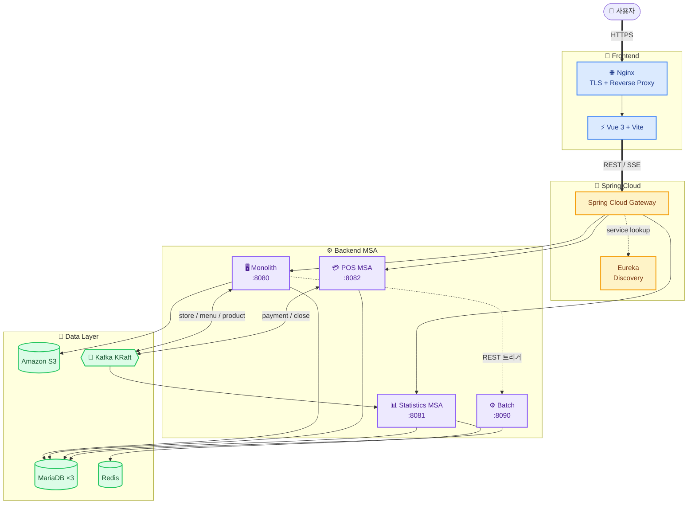

  

---

## ✨ 프로젝트 기본 소개

#### 프로젝트 배경
- 더벤티 본사가 100여 개 가맹점의 발주·재고·배송·정산·매출을 통합 관리할 수 있는 플랫폼이 필요하다.
- 가맹점주는 POS 결제 + 매장 재고 + AI 추천 자동 발주를 한 화면에서 운영할 수 있어야 한다.
- 본사가 실시간/장기 매출 통계로 운영 의사결정을 내릴 수 있어야 한다.

#### 프로젝트 목표
- **본사** : 가맹점 등록/관리, 발주 자동/확정/이상, 배송, 본사 재고, 매출/재고/배송 대시보드, 장기 통계, SSE 알림
- **가맹점** : POS 결제 + 영업 마감 → AI 자동 발주서 생성, 매장 재고, 발주 (수동/제안), 정산
- **통계** : 결제 발생 → Kafka → Redis 사전 집계 (실시간 O(1) 조회), 매일 새벽 MariaDB dump (장기 보존)
- **발주 일괄 승인** : Spring Batch 로 본사 확정 발주를 product 별 파티션 병렬 처리

 

---

### 🌐 NEXUS 사이트 바로가기

**🔐 테스트 계정 (dev seed)**

| 본사 (ADMIN) |                가맹점 (STORE)                 |
|:---:|:------------------------------------------:|
| `admin@theventi.co.kr` / `password123` | `store0001@theventi.co.kr` / `password123` |

---

 

## 🤼‍♂️ 팀원 소개

 

| 권민석 | 노승찬 | 이재혁 | 이지희 | 정동현 |
| :---: | :---: | :---: | :---: | :---: |
|  |  |  |  |  |
| [@RIMIN0650](https://github.com/RIMIN0650) | [@seungchan-0629](https://github.com/seungchan-0629) | [@hijaehyuk](https://github.com/hijaehyuk) | [@dwg0245](https://github.com/dwg0245) | [@DongHyunj](https://github.com/DongHyunj) |

 

---

## 📌 기술 스택

### Frontend

### Backend

### Data

### DevOps / Infra

---

## 🏗️ 시스템 아키텍처

---

## 📋 프로젝트 자료

| 자료          | 링크 |
|-------------|---|
| 🔶 화면 설계    |  |
| 🔶 요구사항 정의서 |  |
| 🔶 WBS      |  |
| 🔶 Swagger  |  |

 

---

## 🗂️ ERD

<b>모놀리식 MariaDB ERD</b>

 

<b>POS MSA MariaDB ERD</b>

 

<b>통계 MSA MariaDB ERD</b>

 

<b>Billing Batch MariaDB ERD</b>

 

---

## ✨ 주요 기능

### 🏢 본사 (Head)

| 아이콘 | 기능 | 설명 |
|:---:|---|---|
| 🏪 | **가맹점 / 기준정보 관리** | 매장 / 메뉴 / 상품 / 카테고리 / 레시피 통합 관리 |
| 📋 | **발주 관리** | 자동 / 확정 / 이상 발주 + **Spring Batch 일괄 승인** |
| 🗃️ | **본사 재고** | 출고 / 입고 / 위험도 (NORMAL / LOW / CRITICAL) |
| 🚚 | **배송 관리** | READY → DELIVERYING → DELIVERED 상태 추적 |
| 📊 | **대시보드 + 장기 통계** | 본사 KPI + 연 / 분기 / 월별 매출 + 매장·메뉴 랭킹 |
| 💰 | **정산** | 반월 단위 자동 정산 (Billing Batch) |

### 🏪 가맹점 (Store)

| 아이콘 | 기능 | 설명 |
|:---:|---|---|
| 💳 | **POS 결제** | 현금 / 카드 결제 (PortOne 연동) + 결제 내역 |
| 🌙 | **영업 마감 + AI 자동 발주** | 일일 마감 → 매장 재고 + 평균 소비량 기반 발주서 자동 생성 |
| 🗃️ | **매장 재고** | `pos_store_inventory` FIFO 차감 + 위험도 |
| 📋 | **발주** | 수동 발주 + AI 제안 발주서 확정 / 수정 / 거절 |
| 📊 | **가맹점 대시보드** | 매출 / 재고 / 정산 / 배송 KPI + 일별 매출 추이 |

### 🌐 공통

| 아이콘 | 기능 | 설명 |
|:---:|---|---|
| 🔐 | **인증 / RBAC** | JWT 인증 + 역할 기반 접근 제어 (ADMIN / STORE) |
| 🔔 | **실시간 알림** | SSE 푸시 (재고 부족 / 이상 발주 / 배송 지연) |
| 🤖 | **AI 챗봇** | 본사 / 가맹점 운영 지원

---

## 🧭 전체 Workflow

> 사용자 → Frontend → Gateway → MSA → Kafka / DB / Redis 의 모듈 간 흐름

> 💡 도메인별 상세 시나리오 (POS 결제 / 영업 마감 / 발주 일괄 승인 / SSE 알림 / 이상 발주 판정 / 장기 통계 dump / 이벤트 동기화 / JWT 인증 등 **8가지 Mermaid 시나리오**) 는 [backend/README.md](backend/README.md) 의 **Service Flow** 섹션 참조

---

## 🔄 CI / CD

### 🚀 배포 파이프라인
- 개발자 `git push` → GitHub Webhook → Jenkins 자동 트리거
- **Build** : Gradle 빌드 → 단위 테스트 → 정적 분석
- **Image** : Docker 이미지 build / Docker Hub push
- **Deploy** : K8s manifest 갱신 → kubectl rollout → **Blue / Green** 전환
- **Monitor** : 배포 후 헬스 체크 + 모니터링

### 🧩 핵심 의사결정
| 항목 | 채택 사유                                                                                                                                                   |
|---|---------------------------------------------------------------------------------------------------------------------------------------------------------|
| 🌐 **Nginx Reverse Proxy + TLS** | 단일 진입점에서 HTTPS 종료 + API 경로별 분기 (`/api/pos` → POS MSA, `/api/statistics` → 통계 MSA, `/api/*` → 모놀리식).   SSE 알림 위해 HTTP/1.1 유지 + `proxy_buffering off`. |
| 🚪 **LoadBalancer Service** | Nginx 가 직접 진입점 역할.                                                                                             |
| 🟦 **Blue / Green 배포** | 기존 Pod 유지 + 새 버전 Pod 띄운 후 Service selector 전환 → **다운타임 0**. 문제 발생 시 즉시 롤백 가능.                                                                           |
| ⚖️ **MetalLB LoadBalancer** | 베어메탈 K8s 환경에서 외부 IP 자동 할당 (클라우드 LB 미사용).                                                                                                                |
| 🔄 **Spring Cloud Gateway + Eureka** | 모듈 간 동적 라우팅 + 서비스 디스커버리. 신규 MSA 추가 시 코드 수정 없이 자동 발견.                                                                                                    |

### 📚 더 자세히 보기 (Wiki)
> CI / CD 의 상세 설계 / 빌드·배포 시나리오 / 무중단 배포 결과 화면은 Wiki 에 정리되어 있습니다.

* 🏗️ [**시스템 아키텍처 & 빌드 / 배포 계획**](https://github.com/beyond-sw-camp/<repo>/wiki/CICD-Architecture) — Nginx 리버스 프록시 / Blue·Green 등 의사결정 배경
* 📸 [**무중단 배포 결과 화면**](https://github.com/beyond-sw-camp/<repo>/wiki/Zero-Downtime-Deploy) — Blue / Green 전환 시연 캡처

---

## 📚 Documents & Wiki

> **프로젝트의 상세한 내용은 아래 문서에서 확인하실 수 있습니다.**

### 🔧 모듈별 상세 README
* 🖥️ [**Backend 자세히 보기**](backend/README.md) — 5개 도메인 모듈 (monolith / pos / statistics / batch / billing-batch) + Spring Cloud (Gateway / Eureka) + 로컬 실행 + Kafka 토픽 + 에러 코드
* 🎨 [**Frontend 자세히 보기**](frontend/README.md) — Vue 3 + Vite 구조 + 페이지 매트릭스 + API 라우팅

### 📜 코딩 컨벤션
* 📝 [**Coding Convention**](https://github.com/beyond-sw-camp/be24-fin-Fiveguys-Nexus/wiki/4.-%EC%BD%94%EB%94%A9-%EC%BB%A8%EB%B2%A4%EC%85%98) — Frontend / Backend 컨벤션

---
