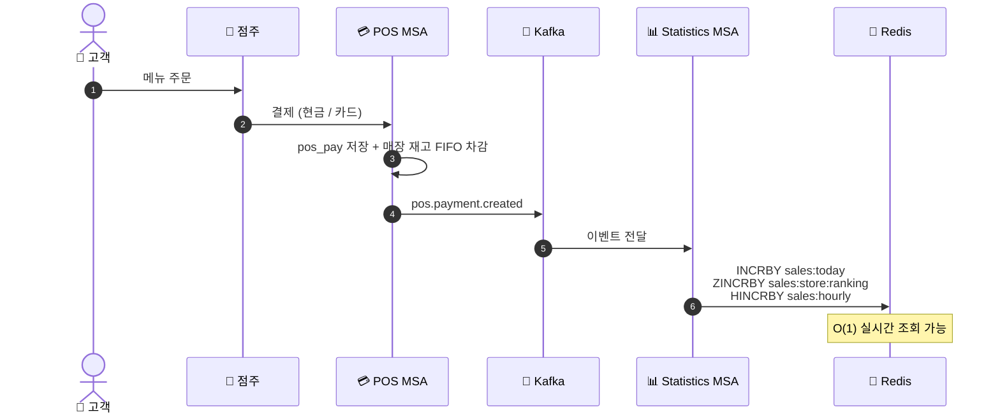
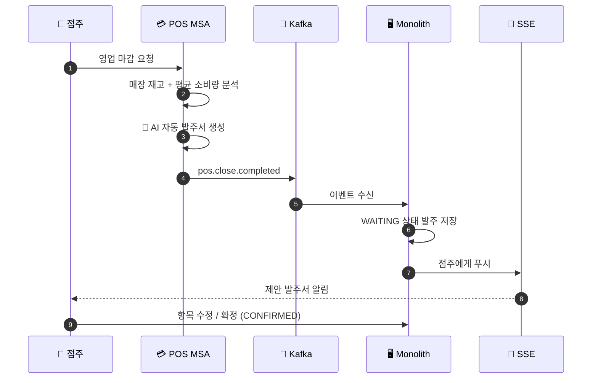
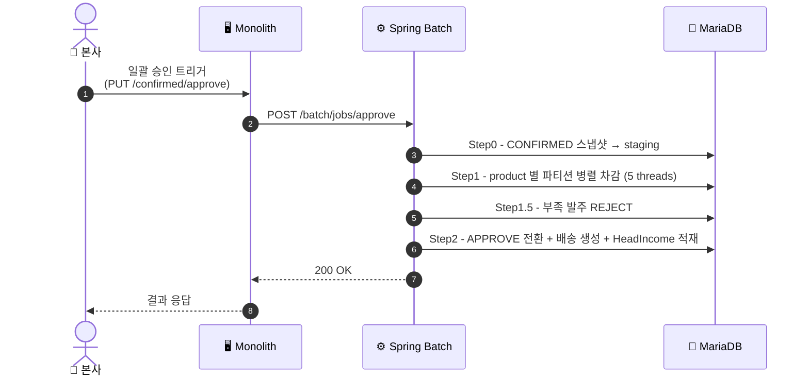
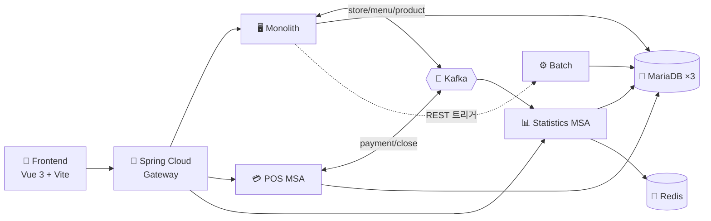

---

 

## 🤼‍♂️ 팀원 소개

 

| 권민석 | 노승찬 | 이재혁 | 이지희 | 정동현 |
| :---: | :---: | :---: | :---: | :---: |
|  |  |  |  |  |
| [@RIMIN0650](https://github.com/RIMIN0650) | [@seungchan-0629](https://github.com/seungchan-0629) | [@hijaehyuk](https://github.com/hijaehyuk) | [@dwg0245](https://github.com/dwg0245) | [@DongHyunj](https://github.com/DongHyunj) |

 

---

## ✨ 프로젝트 기본 소개

#### 프로젝트 배경
- 더벤티 본사가 100여 개 가맹점의 발주·재고·배송·정산·매출을 통합 관리할 수 있는 플랫폼이 필요하다.
- 가맹점주는 POS 결제 + 매장 재고 + AI 추천 자동 발주를 한 화면에서 운영할 수 있어야 한다.
- 본사가 실시간/장기 매출 통계로 운영 의사결정을 내릴 수 있어야 한다.

#### 프로젝트 목표
- **본사** : 가맹점 등록/관리, 발주 자동/확정/이상, 배송, 본사 재고, 매출/재고/배송 대시보드, 장기 통계, SSE 알림
- **가맹점** : POS 결제 + 영업 마감 → AI 자동 발주서 생성, 매장 재고, 발주 (수동/제안), 정산
- **통계** : 결제 발생 → Kafka → Redis 사전 집계 (실시간 O(1) 조회), 매일 새벽 MariaDB dump (장기 보존)
- **발주 일괄 승인** : Spring Batch 로 본사 확정 발주를 product 별 파티션 병렬 처리

 

---

### 🌐 NEXUS 사이트 바로가기

  

**🔐 테스트 계정 (dev seed)**

| 본사 (ADMIN) |                가맹점 (STORE)                 |
|:---:|:------------------------------------------:|
| `admin@theventi.co.kr` / `password123` | `store0001@theventi.co.kr` / `password123` |

---

## 📌 기술 스택

### Frontend

### Backend

### Data

### DevOps / Infra

---

## 🏗️ 시스템 아키텍처

 

---

## 📋 프로젝트 자료

| 자료 | 링크 |
|---|---|
| 🔶 화면 설계 |  |
| 🔶 요구사항 정의서 |  |
| 🔶 WBS |  |

 

### 📘 Swagger UI (모듈별 API 명세서)

| 모듈 | 바로가기 |
|:---:|:---:|
| **Monolith** |  |
| **POS MSA** |  |
| **Statistics MSA** |  |
| **Batch** |  |

 

## 🗂️ ERD

<b>모놀리식 MariaDB ERD</b>

 

<b>POS MSA MariaDB ERD</b>

 

<b>통계 MSA MariaDB ERD</b>

 

<b>Billing Batch MariaDB ERD</b>

 

 

---

## ✨ 주요 기능

### 👉 본사 (Head)

<b>인증 / 가맹점 / 메뉴·상품 / 재고 / 발주 / 배송 / 정산 / 대시보드 / 통계 / ESG / 알림 / 뉴스 / AI / 배치</b>

- **🔐 인증 / 회원** — 로그인 / 회원가입 / 본사 계정 생성 / JWT 인증
- **🏪 가맹점 관리** — 100여 매장 등록 / 정보 수정 / 검색
- **☕ 메뉴 관리** — 메뉴 CRUD + 메뉴 카테고리 + 레시피 (menu_item)
- **📦 상품 / 카테고리** — 원자재 상품 CRUD + 카테고리 관리
- **🗃️ 본사 재고 / 입출고** — `head_inventory` 출고 / 입고 / 위험도 (NORMAL / LOW / CRITICAL) + 이력
- **📋 발주 관리** — 자동 / 확정 / 이력 / 이상 발주 (수량 평균 대비 ratio)
- **⚙️ 발주 일괄 승인 (Spring Batch)** — product 별 파티션 병렬 처리 → APPROVE 전환 + 재고 차감 + 배송 생성
- **🚚 배송 관리** — READY / START / DELIVERYING / DELIVERED / DELAY 상태 추적
- **💰 정산** — 반월 단위 정산 + Billing Batch 자동 처리 + 결제수단 관리
- **📊 본사 대시보드** — 가맹점 / 발주 / 재고 / 배송 KPI + 주간 발주 통계 + 위험 재고 목록 + 이상 발주 통계 + 지연 배송 목록 + 배송 비율
- **📈 장기 통계** — 연도 / 분기 / 월별 매출 + 매장 / 카테고리 / 메뉴 랭킹
- **🌱 ESG 대시보드** — 폐기물 로그 등 ESG 지표
- **🔔 알림 (SSE)** — 본사 실시간 푸시 (재고 부족 / 유통기한 임박 / 이상 발주 / 배송 지연)
- **📰 뉴스 요약** — AI 기반 외부 뉴스 자동 요약
- **🤖 AI 챗봇** — 본사 운영 지원
- **🏦 결제 배치 (Billing Batch)** — 정기 결제 자동 처리

### 👉 가맹점 (Store)

<b>인증 / POS / 매장 재고 / 발주 / 배송 / 정산 / 대시보드 / 알림 / 뉴스 / AI</b>

- **🔐 인증 / 회원** — 로그인 / 가맹점 정보 수정
- **💳 POS 결제** — 메뉴 결제 (현금 / 카드, PortOne 연동) + 결제 내역
- **🌙 영업 마감** — 일일 마감 → AI 자동 발주서 생성 (Kafka 이벤트로 본사 통보)
- **🗃️ 매장 재고** — `pos_store_inventory` FIFO 차감 + 입출고 이력 + 위험도
- **📋 발주** — 수동 발주 + AI 추천 자동 발주서 확정 / 항목 수정 / 거절
- **🚚 배송 현황** — 본사 → 매장 배송 진행 상황 추적
- **💰 정산 내역** — 반월 단위 정산 + 매출 채권
- **📊 가맹점 대시보드** — 매출 KPI + 제안 발주서 + 재고 위험 + 정산 + 일별 매출 추이 + 배송 현황
- **🔔 알림 (SSE)** — 가맹점 실시간 푸시 (배송 / 발주 / 재고)
- **📰 뉴스 / 소식** — 본사 공지 + 뉴스 피드
- **🤖 AI 챗봇** — 가맹점 운영 지원

---

## 🔄 Service Flow

> 핵심 시나리오를 **Mermaid 다이어그램**으로 시각화 (GitHub native 렌더링)

### 🛒 시나리오 1 — POS 결제 → 실시간 통계 사전 집계

### 🌙 시나리오 2 — 영업 마감 → AI 자동 발주서 생성

### ⚙️ 시나리오 3 — 발주 일괄 승인 (Spring Batch)

### 🧭 전체 모듈 흐름도

 

<b>📋 전체 흐름 — 텍스트 상세 (24개 항목 펼쳐 보기)</b>

#### 👤 사용자 및 권한 (Authentication & RBAC)
1. **회원가입 및 로그인** — 본사 관리자는 본사 계정 생성 후 사용. 가맹점주는 신규 가입 후 본사 승인 절차를 거쳐 매장 계정 사용.
2. **JWT 인증** — 로그인 성공 시 Access Token 발급, axios interceptor 가 모든 API 요청에 자동 첨부.
3. **역할 기반 접근 제어 (RBAC)** — `ADMIN` (본사), `STORE` (가맹점) 권한에 따라 API endpoint 접근 범위를 Spring Security 로 분리.

#### 🏪 가맹점주 (Store)
4. **POS 결제** — 메뉴 선택 → 현금 / 카드 결제 (PortOne 연동) → `pos_pay` 저장 + Kafka `pos.payment.created` 발행 (통계 MSA 실시간 집계).
5. **영업 마감** — 일일 영업 종료 → 매장 재고 + 평균 소비량 기반 **AI 자동 발주서 생성** → Kafka `pos.close.completed` → 본사 통보.
6. **매장 재고 관리** — `pos_store_inventory` FIFO 차감 + 입출고 이력 + 위험도 (NORMAL / LOW / CRITICAL) 알림.
7. **자동 발주 제안 확인** — 본사가 제안한 AI 발주서 확인 → 항목 수정 / 확정 (CONFIRMED) / 거절.
8. **수동 발주** — 점주 직접 작성 → 본사 승인 대기열로 진입.
9. **가맹점 대시보드** — 매출 / 재고 위험 / 제안 발주서 / 정산 / 배송 현황 KPI + 일별 매출 추이.

#### 🏢 본사 관리자 (HQ / ADMIN)
10. **기준정보 관리** — 가맹점 / 메뉴 / 메뉴 카테고리 / 상품 / 상품 카테고리 / 레시피 CRUD → Kafka 이벤트로 POS MSA 자동 동기화.
11. **발주 관리** — 자동 / 확정 / 이력 / 이상 발주 조회. 이상 발주는 매장 평균 발주 수량 대비 ratio 초과 시 자동 판정 (`is_danger=true`).
12. **발주 일괄 승인 (Spring Batch)** — 확정 발주 일괄 승인 트리거 → 4 Step (스테이징 → product 별 파티션 병렬 차감 → 부족 reject → APPROVE 전환) → 배송 생성 + 매출 채권 적재.
13. **본사 재고 / 입출고** — `head_inventory` 출고 / 입고 / 위험도 + 이력 추적.
14. **배송 관리** — READY / START / DELIVERYING / DELIVERED / DELAY 상태 전이.
15. **정산 / 결제수단** — 반월 단위 정산 + Billing Batch 자동 처리 + 결제수단 관리.
16. **본사 대시보드** — 가맹점 / 발주 / 재고 위험 / 배송 KPI + 주간 발주 통계 + 이상 발주 / 지연 배송 목록.

#### 📊 통계 MSA (Real-time & Long-term)
17. **실시간 통계 (Redis 사전 집계)** — POS 결제 Kafka 수신 → Redis 키 누적 (`INCRBY` / `HINCRBY` / `ZINCRBY`) → 오늘 매출 / TOP 5 / 시간대별 / 카테고리별 / 결제수단별 **O(1) 조회**.
18. **장기 통계 dump (ShedLock)** — 매일 새벽 5시 분산 락으로 Redis → `daily_*_sales` 테이블 dump → 연 / 분기 / 월 / 매장 / 카테고리 / 메뉴 랭킹 조회.

#### 🤖 자동화 · AI · 알림 (Automation & Intelligence)
19. **AI 자동 발주서 생성** — 매장 영업 마감 후 매장 재고 + 평균 소비량 분석 → 발주 항목 / 수량 자동 추천.
20. **AI 챗봇** — 본사 / 가맹점 운영 지원 (질의응답).
21. **SSE 실시간 알림** — 재고 부족 / 유통기한 임박 / 이상 발주 / 배송 지연 → 본사 / 가맹점에 실시간 푸시.
22. **뉴스 요약** — AI 기반 외부 뉴스 자동 요약.
23. **결제 배치 (Billing Batch)** — 반월 단위 정기 결제 자동 처리.
24. **ESG 데이터 관리** — 폐기물 로그 등 ESG 지표 수집 / 시각화.

---

## 🚀 빠른 시작

> 사전 요구사항: **JDK 17 / Node.js 20+ / Docker Desktop**

| 항목 | 명령 / 안내 |
|---|---|
| 🐳 인프라 (Kafka + Kafka UI) | `docker compose -f docker-compose.local.yml up -d` |
| 🖥️ Backend 실행 | [backend/README.md](backend/README.md) — 모듈 7개 실행 순서 / DB 컨테이너 / 환경변수 |
| 🎨 Frontend 실행 | [frontend/README.md](frontend/README.md) — `npm install && npm run dev` → http://localhost:5173 |

---

## 🔄 CI / CD

### 🚀 배포 파이프라인
- 개발자 `git push` → GitHub Webhook → Jenkins 자동 트리거
- **Build** : Gradle 빌드 → 단위 테스트 → 정적 분석
- **Image** : Docker 이미지 build / Docker Hub push
- **Deploy** : K8s manifest 갱신 → kubectl rollout → **Blue / Green** 전환
- **Monitor** : 배포 후 헬스 체크 + 모니터링

### 🧩 핵심 의사결정 (왜 이 구조를?)
| 항목 | 채택 사유                                                                                                                                                   |
|---|---------------------------------------------------------------------------------------------------------------------------------------------------------|
| 🌐 **Nginx Reverse Proxy + TLS** | 단일 진입점에서 HTTPS 종료 + API 경로별 분기 (`/api/pos` → POS MSA, `/api/statistics` → 통계 MSA, `/api/*` → 모놀리식).   SSE 알림 위해 HTTP/1.1 유지 + `proxy_buffering off`. |
| 🚪 **LoadBalancer Service** | Nginx 가 직접 진입점 역할.                                                                                             |
| 🟦 **Blue / Green 배포** | 기존 Pod 유지 + 새 버전 Pod 띄운 후 Service selector 전환 → **다운타임 0**. 문제 발생 시 즉시 롤백 가능.                                                                           |
| ⚖️ **MetalLB LoadBalancer** | 베어메탈 K8s 환경에서 외부 IP 자동 할당 (클라우드 LB 미사용).                                                                                                                |
| 🔄 **Spring Cloud Gateway + Eureka** | 모듈 간 동적 라우팅 + 서비스 디스커버리. 신규 MSA 추가 시 코드 수정 없이 자동 발견.                                                                                                    |

### 📚 더 자세히 보기 (Wiki)
> CI / CD 의 상세 설계 / 빌드·배포 시나리오 / 무중단 배포 결과 화면은 Wiki 에 정리되어 있습니다.

* 🏗️ [**시스템 아키텍처 & 빌드 / 배포 계획**](https://github.com/beyond-sw-camp/<repo>/wiki/CICD-Architecture) — Ingress / Nginx 리버스 프록시 / Blue·Green 등 의사결정 배경
* 📸 [**무중단 배포 결과 화면**](https://github.com/beyond-sw-camp/<repo>/wiki/Zero-Downtime-Deploy) — Blue / Green 전환 시연 캡처

---

## 📚 Documents & Wiki

> **프로젝트의 상세한 내용은 아래 문서에서 확인하실 수 있습니다.**

### 🔧 모듈별 상세 README
* 🖥️ [**Backend 자세히 보기**](backend/README.md) — 7개 모듈 (monolith / pos / statistics / batch / billing-batch / gateway / discovery) + 로컬 실행 + Kafka 토픽 매트릭스 + 에러 코드
* 🎨 [**Frontend 자세히 보기**](frontend/README.md) — Vue 3 + Vite 구조 + 페이지 매트릭스 + API 라우팅 + 운영 배포

### 📜 컨벤션 (Wiki)
* 📝 [**Commit Convention**](https://github.com/beyond-sw-camp/<repo>/wiki/Commit-Convention) — 커밋 메시지 규칙
* 🐛 [**Issue Convention**](https://github.com/beyond-sw-camp/<repo>/wiki/Issue-Convention) — 이슈 작성 템플릿
* 🔀 [**Pull Request Convention**](https://github.com/beyond-sw-camp/<repo>/wiki/Pull-Request-Convention) — PR 작성 규칙
* 🔄 [**Workflow Convention**](https://github.com/beyond-sw-camp/<repo>/wiki/Workflow-Convention) — 단계별 작업 흐름
* 📘 [**Backend Javadoc Convention**](https://github.com/beyond-sw-camp/<repo>/wiki/Javadoc-Convention) — Controller 주석 규칙

---

