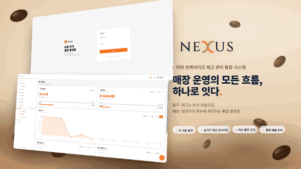
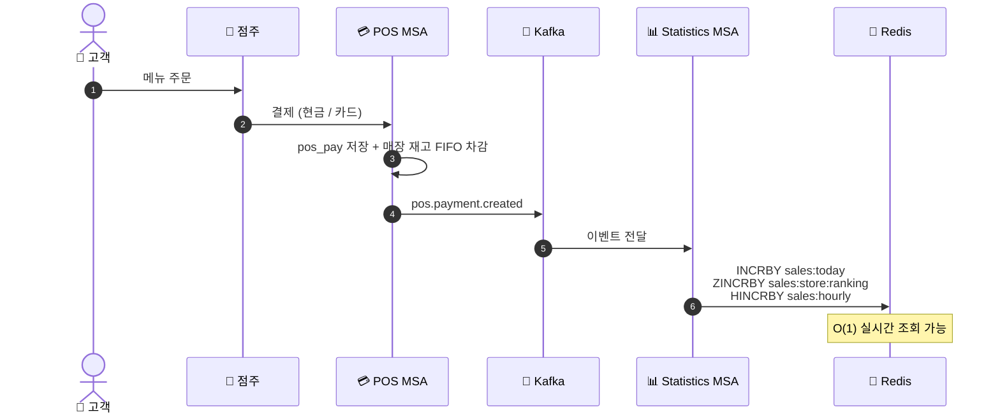
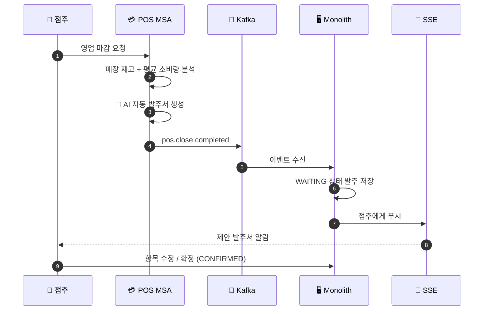
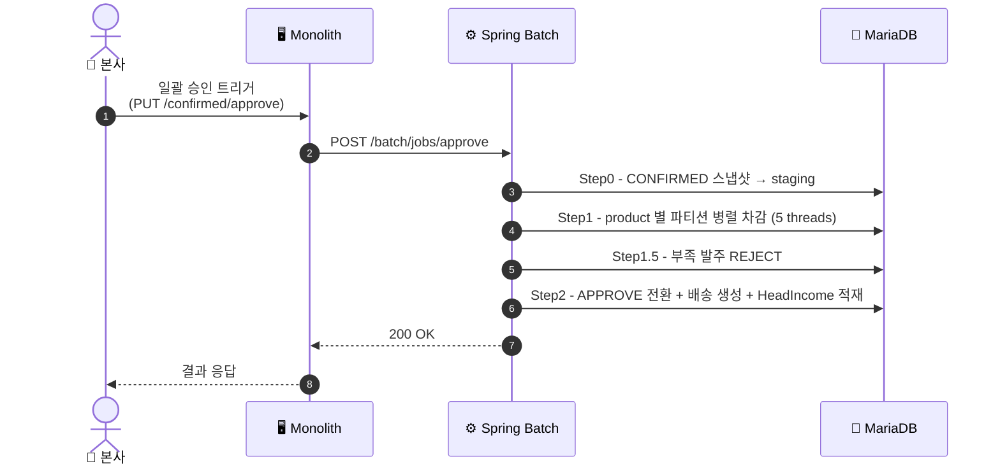
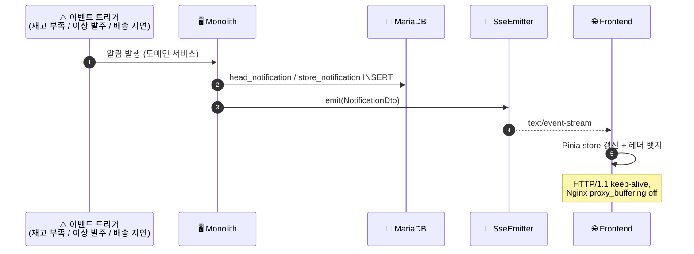
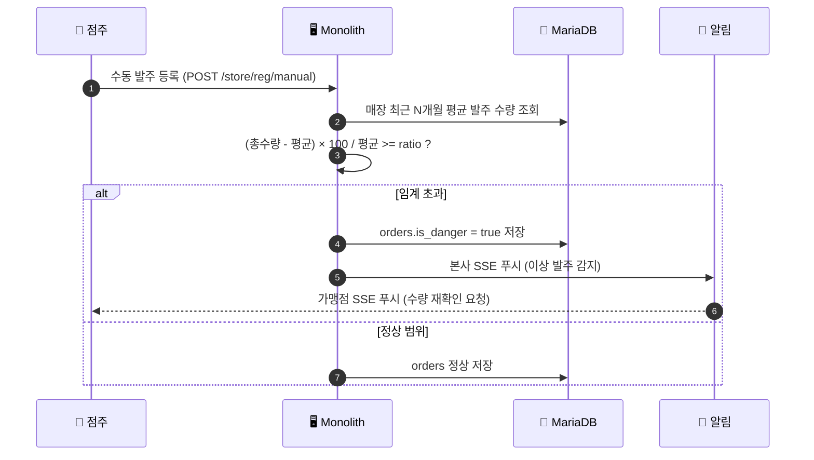
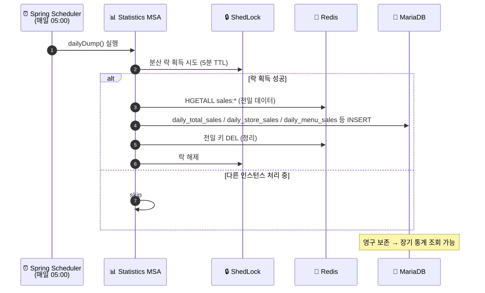
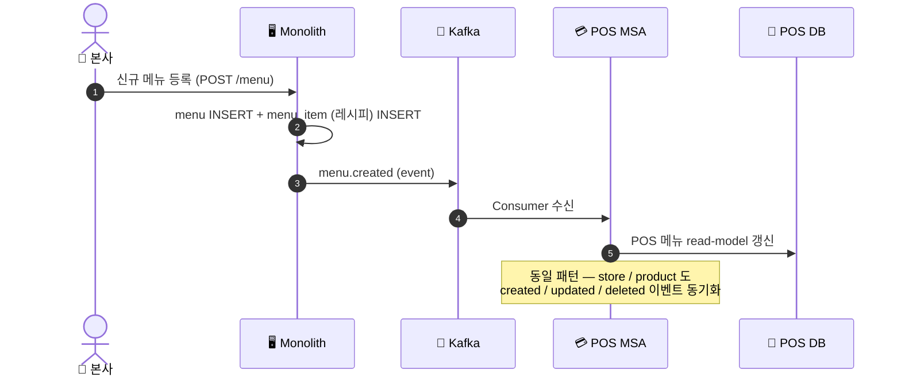
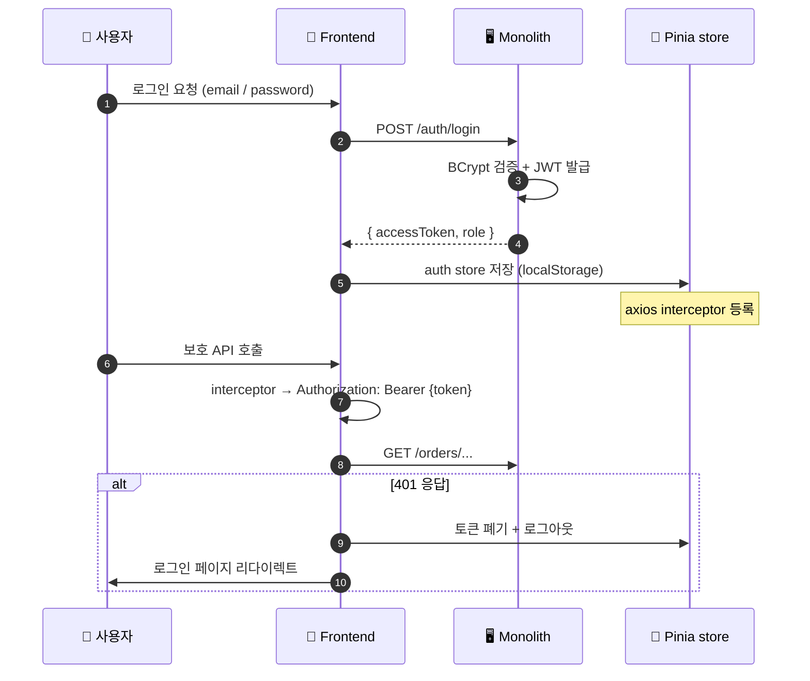

<p align="center">
  
</p>

<h3 align="center">⚙️ Backend — Spring Boot 3.4 MSA + 배치 구조</h3>

<br>

## 🤼‍♂️ 팀원 소개

<br>

| 권민석 | 노승찬 | 이재혁 | 이지희 | 정동현 |
| :---: | :---: | :---: | :---: | :---: |
|  |  |  |  |  |
| [@RIMIN0650](https://github.com/RIMIN0650) | [@seungchan-0629](https://github.com/seungchan-0629) | [@hijaehyuk](https://github.com/hijaehyuk) | [@dwg0245](https://github.com/dwg0245) | [@DongHyunj](https://github.com/DongHyunj) |
| 로그인 / 회원<br/>ESG 대시보드<br/>결제 BATCH | 제품 / 카테고리<br/>배송 / 정산<br/>결제수단 | 재고 / 입출고<br/>주문 / 마감<br/>뉴스 요약<br/>승인 처리 BATCH | 가맹점 / 메뉴<br/>AI 챗봇<br/>POS MSA | 발주 / 알림<br/>대시보드<br/>통계 MSA<br/>인프라 일부 |

<br>

## 📌 기술 스택

<div align="center">


</div>

---

## 🏗️ &nbsp; 소프트웨어 아키텍처

<details>
<summary><b>MSA + 레이어드 아키텍처</b></summary>
<br>

- **모놀리식 + 도메인 MSA**: 본사 운영 도메인은 monolith 에서 응집도 유지, 부하 분리가 필요한 영역 (POS 결제, 통계) 만 MSA 분리
- **레이어드**: Controller → Service → Repository → Domain Model
- **이벤트 기반 통신**: 모듈 간은 Kafka 이벤트로 느슨하게 결합 (store / menu / product / payment / close)
- **Spring Batch + 파티션**: 발주 일괄 승인 시 product 별 파티션 병렬 처리로 대량 처리

> 채택 사유
> 1. 응집도 / 결합도 trade-off — 모놀리식의 빠른 개발 + MSA 의 부하 분리
> 2. Kafka 이벤트로 모듈 간 의존 최소화 → 독립 배포 / 장애 격리
> 3. Spring Batch + ShedLock 분산 락으로 안전한 대량 처리
</details>

<details>
<summary><b>이벤트 흐름 (Kafka)</b></summary>
<br>

```
[Monolith Producer]                          [Consumer]
  store.created  ──────────────────────────→  POS MSA  (매장 동기화)
  store.updated  ──────────────────────────→  POS MSA
  menu.created   ──────────────────────────→  POS MSA  (메뉴 동기화)
  menu.updated   ──────────────────────────→  POS MSA
  menu.deleted   ──────────────────────────→  POS MSA
  product.created  ────────────────────────→  POS MSA  (상품 동기화)
  product.updated  ────────────────────────→  POS MSA
  product.deleted  ────────────────────────→  POS MSA

[POS MSA Producer]                           [Consumer]
  pos.payment.created  ────────────────────→  Statistics MSA  (Redis 사전 집계)
  pos.close.completed  ────────────────────→  Monolith        (AI 자동 발주서)
```
</details>

---

## 🧩 &nbsp; 모듈 구성

| 모듈 | 포트 | 책임 | DB | Kafka |
|---|---|---|---|---|
| **discovery** | 8761 | Eureka 서비스 디스커버리 | — | — |
| **gateway** | 8088 | Spring Cloud Gateway (라우팅) | — | — |
| **monolith** | 8080 | 본사 + 공통 도메인 (발주/알림/대시보드/정산/본사 재고) | MariaDB :3306 | Producer + Consumer |
| **pos** | 8082 | POS 결제, 매장 재고, POS 메뉴 | MariaDB :3308 | Producer + Consumer |
| **statistics** | 8081 | 실시간 / 장기 통계 | MariaDB :3307 + Redis :6379 | Consumer |
| **batch** | 8090 | 발주 일괄 승인 (Spring Batch + REST 트리거) | 모놀리식 DB 공유 (`order_batch.orders_item_staging`) | — |
| **billing-batch** | 8080* | 정산 자동 배치 (Spring Batch) | 모놀리식 DB 공유 | — |

(*) billing-batch 는 K8s 환경에서 별도 컨테이너로 격리. 로컬 동시 실행 시 포트 충돌 주의.

---

## 📦 &nbsp; 모듈 상세

<details>
<summary><b>discovery (Eureka :8761)</b></summary>

- 모든 백엔드 모듈의 서비스 인스턴스 등록 / 헬스 체크
- 다른 모듈은 `eureka.client.service-url.defaultZone` 환경변수로 등록
</details>

<details>
<summary><b>gateway (Spring Cloud Gateway :8088)</b></summary>

- 외부 / 프론트엔드의 진입점 (REST 라우팅)
- 인증 토큰 검증, CORS, 경로 기반 라우팅
- 라우팅 규칙:
  - `/api/pos/**` → POS MSA
  - `/api/statistics/**` → Statistics MSA
  - `/api/**` → Monolith
</details>

<details>
<summary><b>monolith (본사 / 공통 :8080)</b></summary>

- **도메인:**
  - 가맹점 (store) — CRUD, 정산
  - 발주 (orders) — 자동 / 확정 / 이력 / 이상
  - 배송 (delivery)
  - 본사 재고 (head_inventory)
  - 알림 (head_notification, store_notification, SSE)
  - 대시보드 (head + store)
  - 정산 (head_income, billing)
  - 통계 (잔존 — 신규는 Statistics MSA 사용)
  - 인증 (JWT, Security)
- **의존:** MariaDB, Kafka (Producer + Consumer)
</details>

<details>
<summary><b>pos — POS MSA :8082</b></summary>

- **도메인:**
  - 결제 (pos_pay)
  - 매장 재고 (pos_store_inventory)
  - POS 메뉴 (모놀리식 menu 의 read-model)
  - 영업 마감 → AI 자동 발주서 생성 (모놀리식으로 이벤트 발행)
- **의존:** MariaDB (별도 :3308), Kafka
</details>

<details>
<summary><b>statistics — 통계 MSA :8081</b></summary>

- **도메인:**
  - 실시간 — Redis 사전 집계 (`sales:today`, `sales:store:ranking`, `sales:menu:ranking` 등) O(1) 조회
  - 장기 — `daily_*_sales` 테이블 (연 / 분기 / 월별, 매장 / 카테고리 / 메뉴 랭킹)
  - 일별 dump — Redis → MariaDB (매일 새벽, ShedLock 분산 락)
- **의존:** MariaDB (별도 :3307), Redis Cluster, Kafka Consumer
</details>

<details>
<summary><b>batch — 발주 일괄 승인 :8090</b></summary>

- **흐름:** `POST /batch/jobs/approve` → JobLauncher → 4 Step
  1. `prepareOrdersStagingStep` — CONFIRMED 발주 스냅샷을 staging 테이블로
  2. `productProcessPartitionStep` — product 별 파티션 병렬 재고 차감
  3. `rejectInsufficientOrdersStep` — 재고 부족 발주 REJECT 처리
  4. `orderApproveStep` — 최종 APPROVE 전환
- **의존:** 모놀리식 DB 공유 (`order_batch` 별도 스키마)
</details>

<details>
<summary><b>billing-batch — 정산 배치</b></summary>

- **책임:** 정산 자동 배치 (반월 단위 정산 / 매출 채권 결산)
- **의존:** 모놀리식 DB 공유
</details>

---

## 🔄 &nbsp; Service Flow

> 핵심 시나리오를 **Mermaid 다이어그램**으로 시각화 (GitHub native 렌더링). 각 시나리오 토글로 펼쳐 보세요.

<details>
<summary><b>🛒 시나리오 1 — POS 결제 → 실시간 통계 사전 집계</b></summary>
<br>


</details>

<details>
<summary><b>🌙 시나리오 2 — 영업 마감 → AI 자동 발주서 생성</b></summary>
<br>


</details>

<details>
<summary><b>⚙️ 시나리오 3 — 발주 일괄 승인 (Spring Batch)</b></summary>
<br>


</details>

<details>
<summary><b>🔔 시나리오 4 — SSE 실시간 알림</b></summary>
<br>


</details>

<details>
<summary><b>⚠️ 시나리오 5 — 이상 발주 자동 판정 (수량 평균 대비 ratio)</b></summary>
<br>


</details>

<details>
<summary><b>🗄️ 시나리오 6 — 장기 통계 dump (Redis → MariaDB, ShedLock)</b></summary>
<br>


</details>

<details>
<summary><b>🔄 시나리오 7 — 모듈 간 이벤트 동기화 (Kafka)</b></summary>
<br>


</details>

<details>
<summary><b>🔐 시나리오 8 — JWT 인증 + 자동 토큰 첨부 (axios interceptor)</b></summary>
<br>


</details>

---

## ✨ &nbsp; 주요 기능

### ✅ 발주 (Orders)
<details>
<summary><b>본사 / 가맹점 발주 흐름</b></summary>

- **가맹점**: 수동 발주 또는 영업 마감 시 AI 자동 발주서 생성 (`pos.close.completed` 수신)
- **점주**: 자동 발주 제안 → 항목 수정 → 확정 (`CONFIRMED`)
- **본사**: 확정 발주 목록 → 일괄 승인 (Spring Batch) → `APPROVE` 전환 + 재고 차감 + 배송 생성
- **이상 발주 판정**: 매장 평균 발주 수량 대비 ratio 초과 시 `is_danger=true`
</details>

### ✅ 통계 (Statistics MSA)
<details>
<summary><b>Redis 사전 집계 + MariaDB 장기 저장</b></summary>

- **실시간 (Redis)** — POS 결제 발생 시 Kafka 로 발행 → Statistics MSA Consumer 가 Redis 키 누적 (`INCRBY`, `HINCRBY`, `ZINCRBY`)
- **장기 (MariaDB)** — 매일 새벽 5시 ShedLock 분산 락으로 Redis → `daily_*_sales` dump (`#889`)
- **O(1) 조회** — 오늘 매출 / TOP 5 / 시간대별 / 카테고리별 / 결제수단별
- **장기 조회** — 연 / 분기 / 월별 매출, 매장 / 카테고리 / 메뉴 랭킹
</details>

### ✅ 발주 일괄 승인 (Spring Batch)
<details>
<summary><b>4 Step + Product 파티션 병렬 처리</b></summary>

1. **Step0** — `CONFIRMED` 발주 스냅샷을 `order_batch.orders_item_staging` 테이블로 (재실행 안전)
2. **Step1** — product 별 파티션 병렬 처리 (`ThreadPoolTaskExecutor`, 5 threads), `head_inventory` FIFO 출고
3. **Step1.5** — 재고 부족 발주는 `REJECT` 로 롤백
4. **Step2** — 모든 항목 처리된 발주만 `APPROVE` 전환 + 배송 생성 + 매출 채권 (`HeadIncome`) 생성
</details>

### ✅ 알림 (SSE)
<details>
<summary><b>본사 / 가맹점 실시간 알림</b></summary>

- **본사 알림 (`HeadNotification`)** — 재고 부족 / 유통기한 임박 / 이상 발주 / 배송 지연 등
- **가맹점 알림 (`StoreNotification`)** — 매장별 격리
- **SSE** — `text/event-stream` 으로 클라이언트 구독, Nginx buffering off 필수
</details>

---

## 🚀 &nbsp; 로컬 실행

<details>
<summary><b>1. 인프라 컨테이너 (DB 3 + Redis + Kafka)</b></summary>

```bash
# Monolith MariaDB (3306)
docker run -d --name nexus-monolith-db -p 3306:3306 \
  -e MARIADB_ROOT_PASSWORD=qwer1234 -e MARIADB_DATABASE=nexus \
  -v nexus-monolith-db-data:/var/lib/mysql \
  mariadb:11 --character-set-server=utf8mb4 --collation-server=utf8mb4_unicode_ci

# Statistics MariaDB (3307)
docker run -d --name nexus-stats-db -p 3307:3306 \
  -e MARIADB_ROOT_PASSWORD=qwer1234 -e MARIADB_DATABASE=statistics \
  -v nexus-stats-db-data:/var/lib/mysql \
  mariadb:11 --character-set-server=utf8mb4 --collation-server=utf8mb4_unicode_ci

# POS MariaDB (3308)
docker run -d --name nexus-pos-db -p 3308:3306 \
  -e MARIADB_ROOT_PASSWORD=qwer1234 -e MARIADB_DATABASE=pos \
  -v nexus-pos-db-data:/var/lib/mysql \
  mariadb:11 --character-set-server=utf8mb4 --collation-server=utf8mb4_unicode_ci

# Redis (6379)
docker run -d --name nexus-redis -p 6379:6379 \
  -v nexus-redis-data:/data \
  redis:7-alpine

# Kafka (9092) + Kafka UI (8090)
docker compose -f ../docker-compose.local.yml up -d
```
</details>

<details>
<summary><b>2. 환경변수</b></summary>

```bash
# DB
DB_HOST=localhost
MONOLITH_DB_PORT=3306
STATS_DB_PORT=3307
POS_DB_PORT=3308
DB_USERNAME=root
DB_PASSWORD=qwer1234

# Redis
REDIS_HOST=localhost
REDIS_PORT=6379

# Kafka
KAFKA_BOOTSTRAP_SERVERS=localhost:9092

# JWT
JWT_SECRET=<32+ chars>

# Eureka
EUREKA_DEFAULT_ZONE=http://localhost:8761/eureka/

# Batch service (모놀리식에서 호출)
BATCH_SERVICE_URL=http://localhost:8090

# Mail (모놀리식)
MAIL_USERNAME=...
MAIL_PASSWORD=...

# AWS S3 (선택)
AWS_S3_BUCKET=...
```
</details>

<details>
<summary><b>3. 실행 순서</b></summary>

1. **discovery** (8761) — Eureka 서버 (다른 모듈이 등록되려면 먼저 떠야 함)
2. **gateway** (8088)
3. **monolith** (8080), **pos** (8082), **statistics** (8081) — 병렬 가능
4. **batch** (8090)
5. (선택) **billing-batch** — 포트 충돌 주의
</details>

<details>
<summary><b>4. 시드 데이터 (dev)</b></summary>

```bash
# 모놀리식 (매장 100 + 결제 / 발주 / 알림 등)
docker exec -i nexus-monolith-db mariadb -uroot -pqwer1234 nexus \
  < monolith/src/main/resources/seed-dev.sql

# 통계 MSA
docker exec -i nexus-stats-db mariadb -uroot -pqwer1234 statistics \
  < statistics/src/main/resources/seed-dev.sql

# Redis 사전 집계
REDIS_CLI="docker exec -i nexus-redis redis-cli" bash \
  statistics/src/main/resources/seed-redis-dev.sh
```

**로그인 (dev seed):**
- 본사: `admin@theventi.co.kr` / `password123`
- 가맹점: `store0001@theventi.co.kr` ~ `store0100@theventi.co.kr` / `password123`
</details>

---

## 📡 &nbsp; Kafka 토픽 매트릭스

| 토픽 | Producer | Consumer | 용도 |
|---|---|---|---|
| `store.created` | monolith | pos | 매장 등록 시 POS 동기화 |
| `store.updated` | monolith | pos | 매장 정보 변경 동기화 |
| `menu.created` | monolith | pos | 신규 메뉴 POS 동기화 |
| `menu.updated` | monolith | pos | 메뉴 정보 변경 |
| `menu.deleted` | monolith | pos | 메뉴 삭제 |
| `product.created` | monolith | pos | 신규 상품 동기화 |
| `product.updated` | monolith | pos | 상품 정보 변경 |
| `product.deleted` | monolith | pos | 상품 삭제 |
| `pos.payment.created` | pos, monolith | statistics | 결제 발생 → 통계 사전 집계 |
| `pos.close.completed` | pos | monolith | 영업 마감 → AI 자동 발주서 생성 |

---

## 📘 &nbsp; Swagger UI

| 모듈 | URL |
|---|---|
| monolith | http://localhost:8080/swagger-ui/index.html |
| pos | http://localhost:8082/swagger-ui/index.html |
| statistics | http://localhost:8081/swagger-ui/index.html |
| batch | http://localhost:8090/swagger-ui/index.html |

---

## ⚠️ &nbsp; 응답 / 에러 컨벤션

<details>
<summary><b>BaseResponse 구조</b></summary>

```json
{
  "success": true,
  "code": 2000,
  "message": "요청 성공",
  "result": { ... }
}
```
</details>

<details>
<summary><b>BaseResponseStatus 에러 코드 (모놀리식)</b></summary>

| 코드 | 이름 | 의미 |
|---|---|---|
| 2000 | SUCCESS | 성공 |
| 3105 | STORE_NOT_FOUND | 가맹점 정보 없음 |
| 3202 | NOT_FOUND_PRODUCT | 상품 없음 |
| 3204 | NOT_FOUND_MENU | 메뉴 없음 |
| 3306 | STORE_INVENTORY_INSUFFICIENT | 매장 재고 부족 |
| 3307 | POS_STORE_INVENTORY_INSUFFICIENT | POS 매장 재고 부족 |
| 4001 | REQUEST_ERROR | 요청 형식 오류 |
| 4002 | NOT_FOUND_DATA | 일반 데이터 없음 |
| 4201 | ORDERS_APPROVE_INSUFFICIENT_STOCK | 본사 재고 부족으로 승인 불가 |
| 4202 | NOT_FOUND_ORDERS | 발주 없음 |
| 4203 | NOT_FOUND_ORDERS_ITEM | 발주 항목 없음 |
| 4204 | ORDERS_NOT_AUTHORIZED | 해당 발주 권한 없음 |
| 4205 | ORDERS_INVALID_STATUS | 현재 발주 상태에서 처리 불가 |
| 4209 | ORDERS_ITEMS_EMPTY | 발주 항목 비어있음 |
| 4210 | BATCH_SERVICE_UNAVAILABLE | 배치 서비스 호출 실패 |
| 4301 | NOT_FOUND_NOTIFICATION | 알림 없음 |
| 5000 | FAIL | 일반 실패 |
| 5001 | DATABASE_ERROR | DB 처리 오류 |

전체 정의: `monolith/src/main/java/com/example/nexus/common/model/BaseResponseStatus.java`
</details>

---

## 📜 컨벤션

- **Javadoc:** [.claude/convention/JAVADOC_CONVENTION.md](../.claude/convention/JAVADOC_CONVENTION.md)
- **커밋 / PR / 이슈:** 루트 [README.md](../README.md) 의 컨벤션 섹션 참조

---


